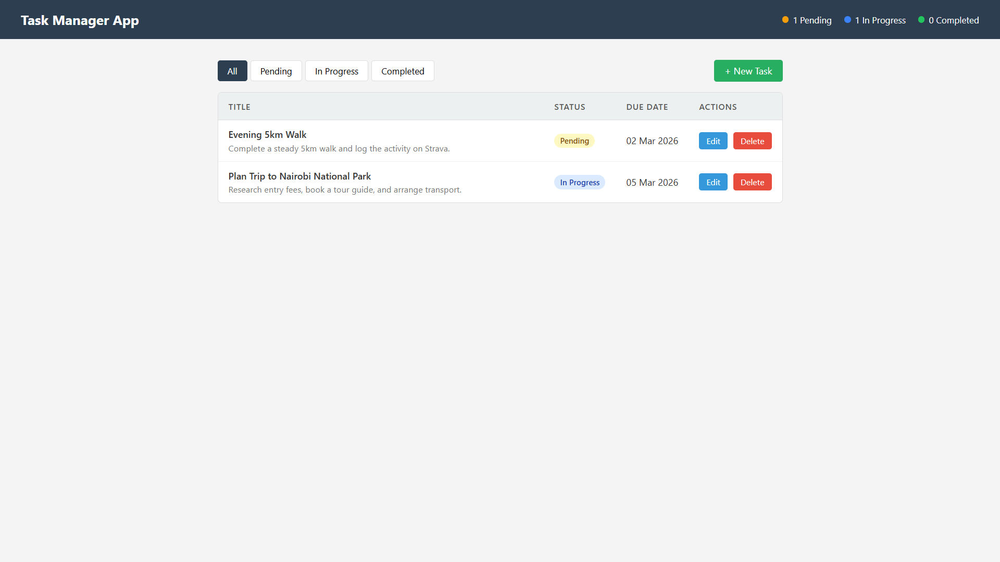
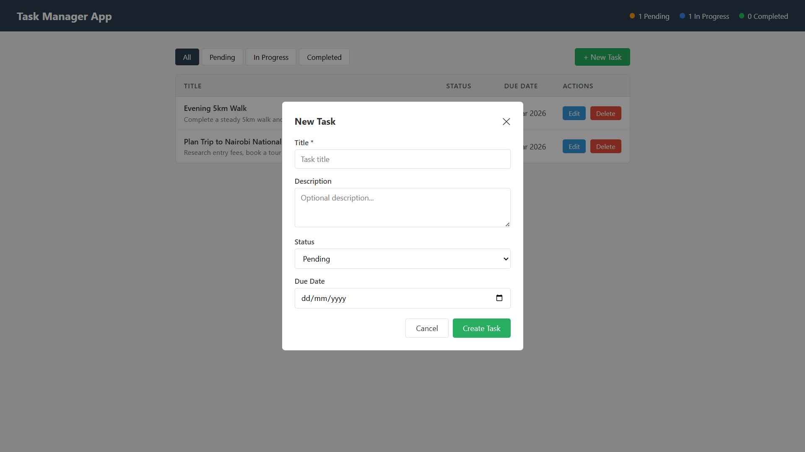
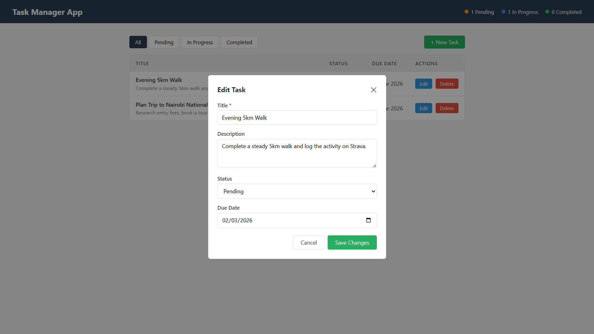
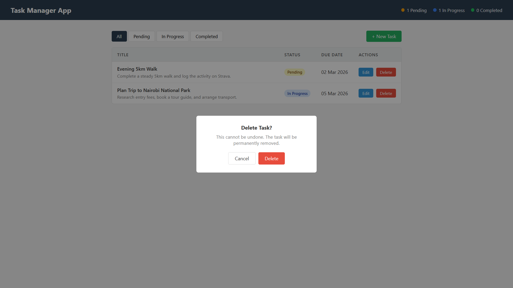

# Task Manager — Frontend

The frontend for the Task Management System. Built with plain HTML, CSS, and Vanilla JavaScript — no frameworks, no build step required.

---

## Live Demo

**API:** http://taskmanagerapp26.runasp.net/api/tasks  
**Backend Repository:** https://github.com/makumi10/taskmanager-backend.git

---

## Tech Stack

| Layer      | Technology                |
|------------|---------------------------|
| Markup     | HTML5                     |
| Styling    | CSS3                      |
| Logic      | Vanilla JavaScript (ES6+) |

---

## Project Structure

```
frontend/
├── index.html        
├── style.css   
└── script.js        
```

### File Descriptions

- **`index.html`** — Clean, minimal table-based interface. Linked to `style.css` and `script.js`.
- **`style.css`** — All styles for the simple UI.
- **`script.js`** — All JavaScript logic for the simple UI — API calls, rendering, modals, toasts.

---

## Running Locally

No installation or build step required. Simply:

1. Clone the repository:
```bash
git clone https://github.com/makumi10/taskmanager-frontend.git
cd taskmanager-frontend
```

2. Open frontend file directly in your browser:
```
index.html

```

> **Note:** The frontend communicates with the live hosted API by default. If you want to run it against a local API instead, update the `API_BASE` variable in `script.js`:
> ```js
> const API_BASE = 'https://localhost:{port}/api/tasks';
> ```

---

## Features

- View all tasks in a table layout.
- Color-coded status indicators — Pending, In Progress, Completed
- Filter tasks by status
- Create a new task via a modal form with validation
- Edit an existing task
- Delete a task with a confirmation dialog
- Live task count stats in the header
- Loading states and error handling
- Toast notifications for all actions
- Fully responsive layout

---

## API Integration

The frontend communicates with the backend via REST API calls using the browser's native `fetch()`. All requests are handled asynchronously with proper loading states and error handling.

The backend API repository can be found here:  
https://github.com/makumi10/taskmanager-backend.git

---

## Screenshots

### Dashboard


### Create Task Modal


### Edit Task Modal


### Delete Task Modal



---

## Author

**Brian Makumi** 

Practical Assignment — Health Tech Solutions  
February 2026

https://www.brianmakumi.com